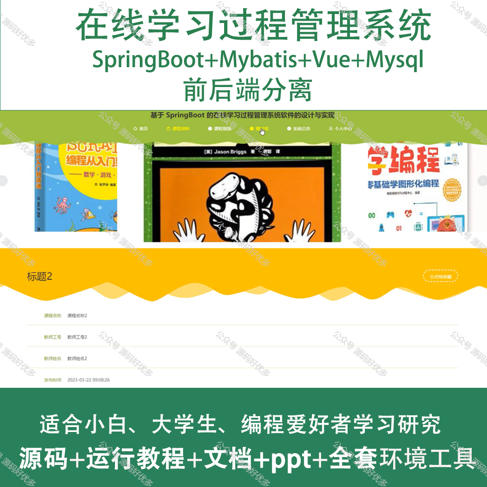
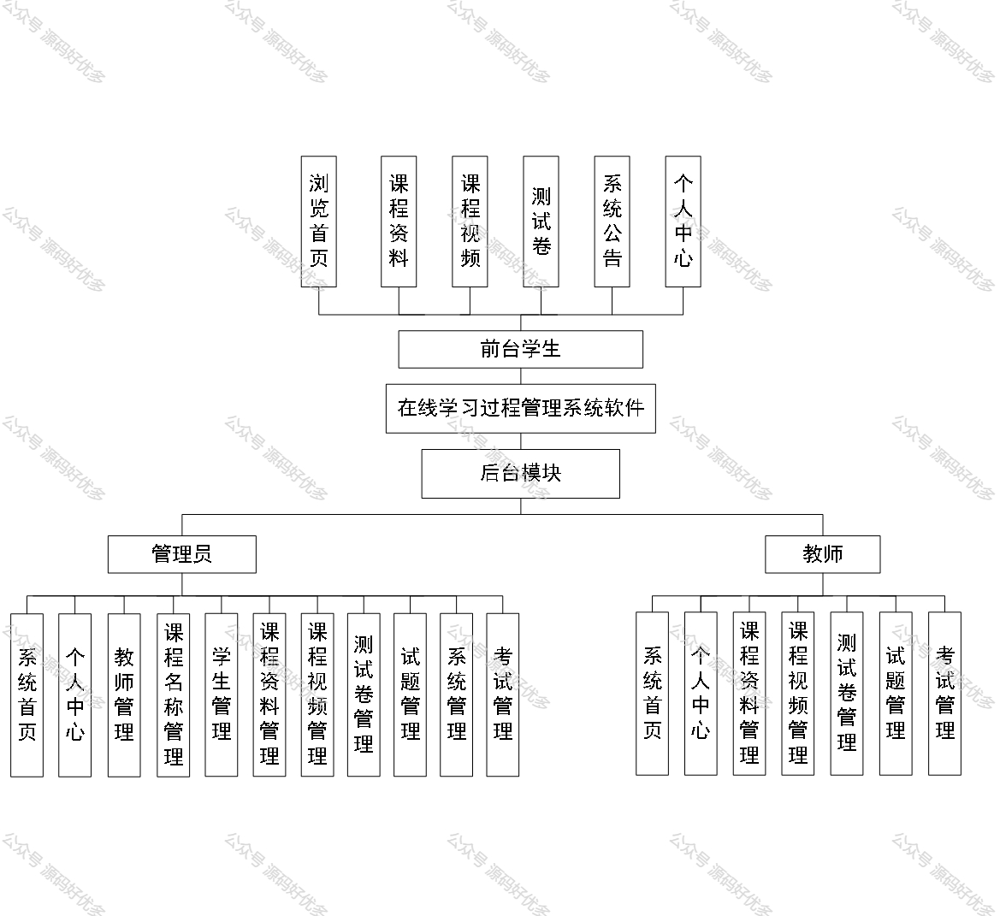
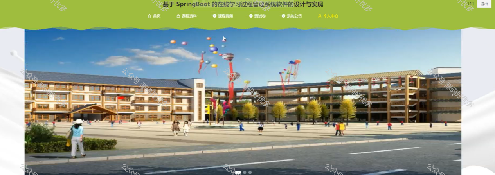
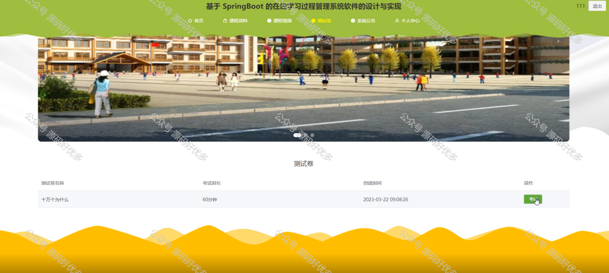
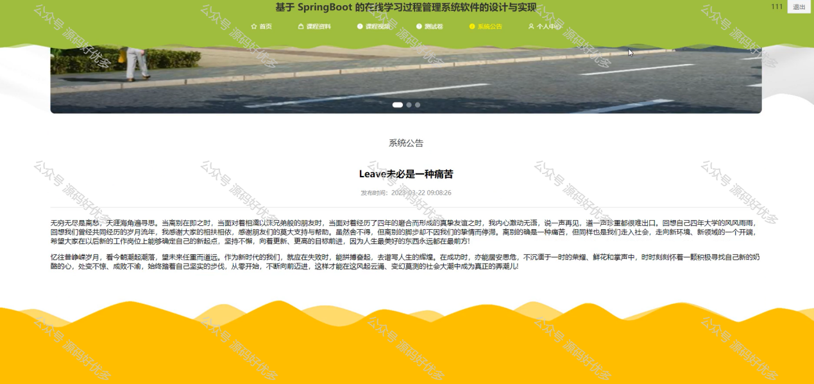
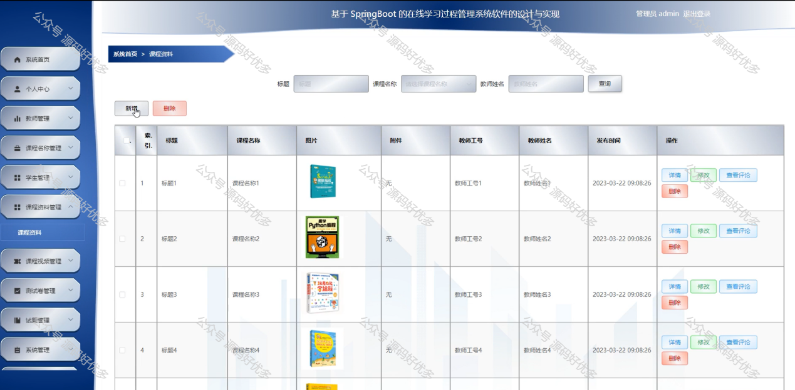
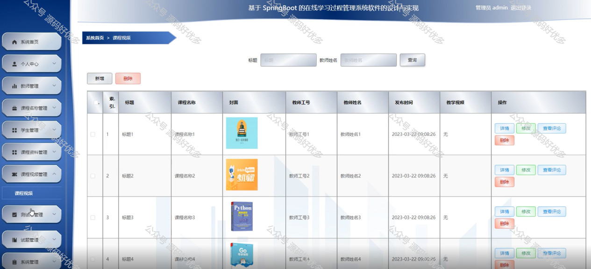
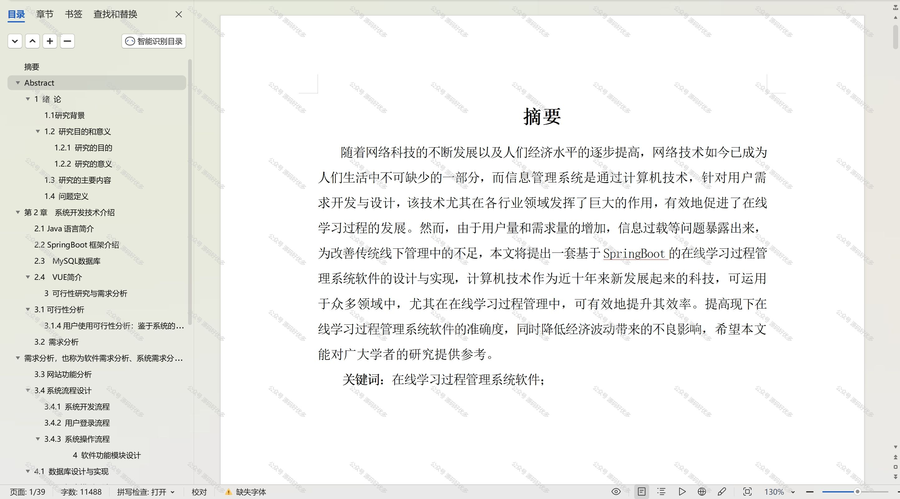

 
## 查看主页获取源码

### 一、作品包含

源码+数据库+设计文档万字+PPT+全套环境和工具资源+部署教程

### 二、项目技术

前端技术：Html、Css、Js、Vue、Element-ui

数据库：MySQL

后端技术：Java、Spring Boot、MyBatis

  

### 三、运行环境

开发工具：IDEA/eclipse

数据库：MySQL5.7

数据库管理工具：Navicat10以上版本

环境配置软件： JDK1.8+Maven3.6.3

前端Nodejs：14

### 四、项目介绍
项目编号：springbootA196

在线学习过程管理系统是在远程教育和网络学习日益普及的背景下发展起来的，以提高学习效率和质量、进度和成果，为教师提供教学决策支持，同时为学习者提供个性化的学习路径和资源推荐，确保在线学习环境下的教学互动和学习体验，从而促进教育信息化和现代化进程。

前台学生功能：浏览首页、课程资料、课程视频、测试卷、系统公告、个人中心。

后台分为管理员和学生
管理员的功能：系统首页、个人中心、教师管理、课程名称管理、学生管理、课程资料管理、课程视频管理、测试卷管理、试题管理和系统管理以及考试管理。
学生的功能：系统首页、个人中心、课程资料管理、课程视频管理、测试卷管理、试题管理和考试管理。

### 五、运行截图

  
